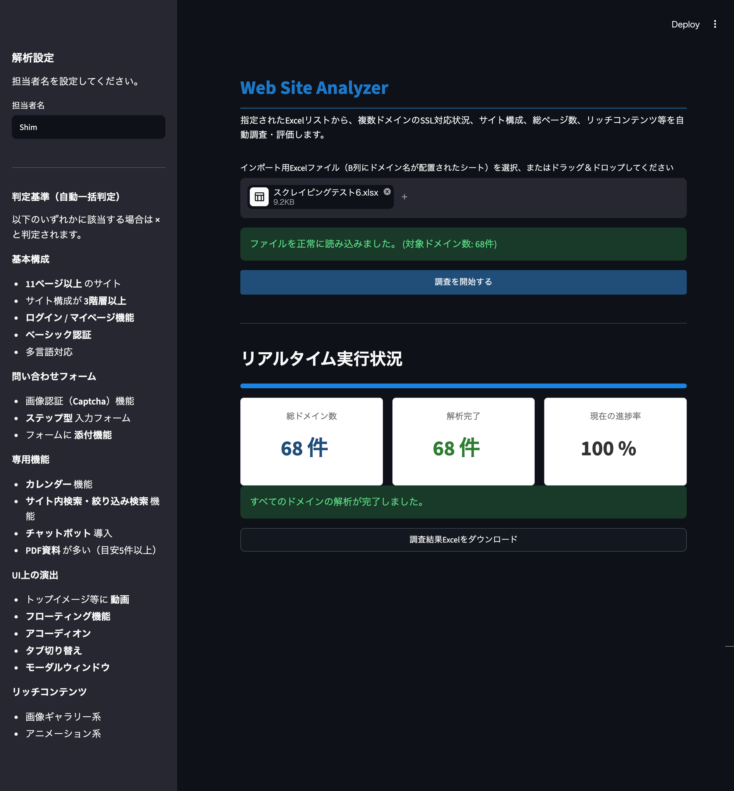

# Web Site Analyzer

A GUI-based multi-domain website analysis and evaluation system, built for learning Python and as a portfolio project.

It was developed to systematically learn practical backend architecture patterns used in real-world systems: concurrency (thread-safe state management in a multi-threaded `ThreadPoolExecutor` environment), crash-resilient state persistence with SQLite, defensive techniques for robust crawling, and state management built around the value-object design philosophy.

---

## Overview

Given an Excel list of domains (with domain names in column B), this web application automatically crawls each domain to check **SSL support (including whether HTTPS is enforced), site structure (multi-signature CMS detection), and total page count**, then assigns a business evaluation (**◯, ×, or 要確認 / "needs review"**) based on a configurable page-count threshold, site depth, presence of a login/member area, file-attachment support in contact forms, Basic Authentication, multilingual support, CAPTCHA on contact forms, specialized features (calendars, on-site search, chatbots), design gimmicks (video, floating buttons, accordions, tabs, modals), and rich content (Lightbox galleries, scroll animations, etc.).

This is more than a simple scraper: it implements its own crawl-rate throttling to minimize load on target servers, spoofed headers to work around Cloudflare and similar bot-blocking (403/401 errors), detection and root-cause classification of block pages served by network security appliances such as Fortinet, detection of "site has moved" redirect pages (automatic redirects to a different domain), a two-tier SSL audit mechanism combining HTTP redirect tracking with a direct HTTPS check, and a safety mechanism that detects infinite link traps and aborts crawling.

Job state is persisted to SQLite, so job progress is automatically recovered on the next startup even if the app is force-terminated.

The frontend is built with Streamlit. By coordinating `st.rerun()` with a background thread (internally, a pool of parallel workers managed by `ThreadPoolExecutor`), the app delivers a real-time monitoring UI that renders progress smoothly without ever freezing.

---

## Key Features

* **Parallel crawling (thread-pool control via `ThreadPoolExecutor`)**
  * The entire job is delegated to a background thread via `threading`, and within that job, individual domains are processed concurrently by a `ThreadPoolExecutor` (5 workers by default). The worker count is tuned to balance throughput against memory pressure, even for heavier operations that involve JS rendering (Playwright).
  * If an exception occurs while processing one domain, only that domain's result is recorded as "needs review" — processing of other domains, and completion of the job as a whole, continues uninterrupted.
  * Mutual exclusion (`threading.Lock`) ensures that result writes from multiple worker threads are applied atomically, completely eliminating data races and display inconsistencies with the thread reading progress on Streamlit's side.
  * The Streamlit rendering main thread is kept 100% free even during heavy network I/O, eliminating UI freezes.

* **Crash-resilient state persistence with SQLite**
  * Jobs and assessment results are synced not only to an in-memory cache but also to SQLite running in WAL mode. Each domain's result is written to the DB the moment it completes, so no completed work is lost even if the process dies mid-run.
  * On startup, a consistency check (`reconcile_interrupted_jobs`) automatically detects any job still left in a `processing` state from an abnormal termination and marks it `interrupted`, preventing the UI from appearing to hang forever in a "processing" state.
  * `st.cache_resource` shares a single instance of the service layer across the whole process, so job progress survives browser reloads and session disconnects.

* **Intelligent crawler-defense evasion and SSL auditing**
  * **Smart SSL & redirect verification**: The initial request is made over `http://`, tracking whether a WAF or the server itself issues an automatic redirect to `https://` — this is the actual criterion for "HTTPS enforced." If no redirect occurs, the tool independently verifies a direct `https://` connection as a flexible fallback.
  * **Support for HTTPS-only sites**: For sites where the `http://` connection itself fails (e.g., port 80 isn't accepted), a fallback attempts a direct `https://` connection, avoiding a false "undeterminable" result. If a certificate hostname mismatch (`SSLError`) is detected, the tool also retries once against the `www.`-prefixed domain.
  * **Detection of block pages from network security appliances**: When a device such as a Fortinet Webfilter performs SSL inspection and intercepts/replaces the traffic, the crawler may end up fetching the appliance's block page instead of the actual site content. The tool detects this, explicitly surfaces the likely cause (category classification, possible SSL certificate error, etc.) as the judgment reason, and short-circuits the rest of the evaluation logic, reporting the result as "needs review."
  * **Detection of "site relocated" pages**: If a page auto-redirects to a different domain after a few seconds via meta refresh or a JS timer (a typical "we've moved" notice page), the tool bypasses the normal evaluation logic entirely, immediately marks the result as "×" (already renewed/relocated), and records the destination URL in the remarks column.
  * **Safe fallback on unreachable sites**: DNS errors, bot-blocking (403/401), timeouts, and similar exceptions are all safely caught without crashing the app, resulting in an "undeterminable" state. This is carried into the crawl phase as "0 pages," which classifies the final result as "needs review" with an appropriate error reason.
  * **Browser impersonation (User-Agent) and traffic spoofing**: Mimics the headers of an up-to-date web browser (Chrome) in order to get past defenses that would otherwise immediately block a plain Python scraper.
  * **Infinite link-trap detection**: In addition to simple repeating paths generated by things like calendar pages, the tool also detects repeating segment patterns caused by misresolved relative paths in JS-based navigation, preventing infinite crawling.

* **High-precision, dynamic detection of major CMS platforms and site structure**
  * Goes beyond static HTML parsing, using signatures found in the HTML source — such as `wp-content` / `wp-includes` assets — to identify 30+ CMS platforms both domestic and international, including WordPress, baserCMS, EC-CUBE, Movable Type, Shopify, and Wix. Non-CMS sites are automatically identified and left blank.
  * Detection isn't limited to `<form>` tags — it also covers `role="form"` and pseudo-forms built from `div`s, resolving form field labels from multiple sources including `aria-labelledby`, `label for`, and ancestor-element analysis. Externally embedded forms (HubSpot, Tayori, etc.) are also detected. Forms inside iframes are analyzed recursively.

* **Multi-signal automatic detection and generation of evaluation reasons**
  * Detects and automatically lists, as evaluation reasons: excessive page count, a 3+ level deep site structure, login/member-area functionality, file-attachment support in contact forms, Basic Authentication (checked both on the initial request and on every page fetched during the crawl), multilingual switching, image CAPTCHA on forms, calendar functionality, on-site/filtered search, chatbot integration, video in the hero area, floating buttons, accordions, tab switching, modal windows, Lightbox-style galleries, and heavy use of scroll animation (GSAP, etc.). To detect accordions, tabs, modals, and floating buttons, the tool deliberately avoids generic attributes like `data-toggle` / `aria-expanded` — which are also common in ordinary hamburger-menu navigation and would cause false positives — and instead uses a dedicated CSS selector/class name per feature.
  * Google Maps embeds are intentionally excluded from detection, since they appear on nearly every corporate site's "access" page and don't function as a meaningful signal on their own.
  * When the site depth is measured as extremely deep and the automated measurement can't be trusted (more than 10 levels), the tool deliberately avoids forcing a numeric judgment and instead reports "needs review" for manual inspection.

* **Robust real-time UI built on session state**
  * A stateful design built around Streamlit's `st.session_state`. The `job_id` is also kept in the URL query parameters, so an in-progress job can still be tracked even if the browser is fully reloaded into a brand-new session.
  * Eliminates blocking `while True` loops in favor of "active asynchronous polling" (roughly every 1.5 seconds) via `st.rerun()` and a background thread, giving real-time updates to the progress display and metric cards.

* **Model design and type safety aligned with Mypy Strict**
  * The domain model `ScrapingJob` is designed to be immutable (read-only), enforcing thread-safe state management. When state needs to change, a new instance is created instead — a "value object" design philosophy applied consistently.
  * Numeric fields on `SiteAssessment` (page count, depth) are strictly typed as `int | None`. String representations meant purely for display (e.g. rendering "100+" once the page count reaches 100) are deferred all the way to the point of Excel export, keeping the business logic itself free of Mypy errors and preserving type safety.

* **Shared logging infrastructure with decorators for cross-cutting concerns**
  * A shared `dictConfig`-based logger configuration (`utils/logger.py`) is applied once at app startup, writing to both the console (INFO and above) and a per-run log file with a second-level timestamp in its name (`logs/app_YYYYMMDD_HHMMSS.log`, DEBUG and above). Every module benefits from this unified logging setup just by calling `logging.getLogger(__name__)`.
  * Cross-cutting concerns such as `measure_time` (execution-time measurement) and `log_action` (start/finish logging) are factored out as decorators and applied thinly to the crawling, SSL-checking, and Excel-export code paths, keeping logging statements out of the core business logic.

---

## Screenshots

### Main Window



---

## Tech Stack

| Category | Technology |
| --- | --- |
| Language | Python 3.12+ |
| Package Management | uv |
| Web UI Framework | Streamlit (custom flat UI with CSS styling) |
| Scraping & Parsing | HTTPX, BeautifulSoup4 (prefers the `lxml` parser; optional JS rendering via Playwright) |
| SSL Verification | Requests |
| Persistence | SQLite (WAL mode) |
| Data Processing | OpenPyXL (Excel import/export, merging results while preserving original row order) |
| Testing | Pytest |
| Linter & Formatter | Ruff |
| Type Check | Mypy (Strict mode compliant) |
| CI/CD | GitHub Actions |

---

## Directory Structure

```text
PYTHON-WEB-ANALYZER/
├── docs/                      # Documentation (requirements spec, etc.)
├── src/
│   └── web_analyzer/          # Application source code
│       ├── core/              # Core logic
│       │   ├── crawler.py         # Crawler (site traversal, fetching, block/redirect detection)
│       │   ├── evaluator.py       # Evaluation / judgment logic
│       │   ├── excel_service.py   # Excel export/formatting
│       │   ├── job_repository.py  # Persists jobs and assessment results to SQLite
│       │   ├── scraper_service.py # Parallel scraping orchestration (ThreadPoolExecutor)
│       │   └── ssl_checker.py     # SSL/TLS certificate and redirect verification
│       ├── utils/             # Shared utilities
│       │   ├── decorators.py      # measure_time / log_action decorators
│       │   └── logger.py          # dictConfig-based shared logger setup
│       ├── __init__.py
│       ├── main.py            # Application entry point (Streamlit UI)
│       └── models.py          # Data models (ScrapingJob / SiteAssessment)
├── data/                       # Output location for the SQLite database file
├── temp/                      # Temporary file output directory
├── logs/                      # Output location for per-run log files
├── tests/                     # Unit tests
│   ├── test_evaluator.py      # Tests for evaluation logic
│   ├── test_excel_service.py  # Tests for Excel output
│   └── test_ssl_checker.py    # Tests for SSL verification
├── .gitignore
├── .python-version
├── LICENSE                    # MIT License
├── pyproject.toml             # Project configuration and dependencies
├── README.md                  # Project overview and reviewer-facing documentation
└── uv.lock                    # uv lockfile (strict version locking)

```

---

## Prerequisites

* Python 3.12 or later
* uv (required to reproduce a consistent dev/runtime environment)

If `uv` isn't installed yet, run:

```bash
pip install uv

```

---

## Installation & Environment Reproduction (dependency locking via uv)

`uv` is used to fully eliminate version-drift bugs between distribution/development environments and to reproduce a consistent runtime environment.

```bash
git clone <repository-url>
cd PYTHON-WEB-ANALYZER

# Sync dependencies exactly as recorded in the lock file using uv
# (a virtual environment is created automatically)
uv sync

```

---

## Running the App

```bash
uv run streamlit run src/web_analyzer/main.py

```

---

## Quality Assurance & Testing

### Running Tests

```bash
uv run pytest

```

### Ruff (Linter & Formatter)

```bash
uv run ruff check .
uv run ruff format .

```

### Mypy (Type Check)

```bash
uv run mypy src tests

```

---

## GitHub Actions (CI)

A CI pipeline is set up using GitHub Actions.

Jobs are split into two stages, so that tests only run once static analysis (lint/type check) has succeeded.

### 1. Lint Job

* Ruff
* Mypy

### 2. Test Job

* Pytest

```yaml
test:
  needs: lint

```

This means that if a lint error occurs, the (unnecessary) test run is skipped, saving CI execution resources.

---

### Unit Test Coverage

To ensure robustness, core logic is thoroughly covered by unit tests using `pytest`.

#### 1. Evaluation / Judgment Logic (Evaluator)

* **Threshold-evaluation validity tests**: Verifies that the `◯` / `×` judgment and its reason text are mapped correctly for each condition — the configured page-count threshold (`page_threshold`), site depth, login functionality, attachment support, Basic Authentication, multilingual support, image CAPTCHA on contact forms, specialized features (calendar / on-site search / chatbot), design gimmicks (video / floating buttons / accordions / tabs / modals), and the presence of rich content.
* **Automatic "needs review" generation tests**: Verifies that `RenewalEvaluator.decide()` returns "needs review" as the top-priority result on connection failure (0 pages), an extremely small page count (1–2 pages with an unexhausted crawl queue), or an unmeasurably deep site structure — and that in the normal case, it delegates internally to `evaluate()`, generating an appropriate reason text based on the evaluation outcome. This branching logic is consolidated entirely within `evaluator.py`; `SiteScraperService` itself contains none of this decision logic.

#### 2. Excel Import/Export Service (ExcelService)

* **Row-order preservation and round-trip guarantees**: I/O tests confirming that the row order and structure of the imported Excel sheet are fully preserved while merging in the analysis date (M/D format) and each status field on export. Also verifies that page counts of 100 or more are safely converted to the string `"100以上"` ("100+") on export, along with correct handling of illegal control characters (stripped without raising an exception).

#### 3. Security Auditing Module (SslChecker)

* **SSL connection & redirect verification correctness**: Validates the initial connection parameters (a 10-second request timeout by default), the fallback to a direct `https://` connection when `http://` itself fails, the branch that retries against a `www.`-prefixed domain only on a certificate hostname mismatch, and the handling all the way from a normal HTTPS connection through to exception handling (returning `None, None` when the result is undeterminable). All of this is verified purely at the logic level, without any real network traffic, by mocking `requests.Session` with a `FakeSession`.

---

## Advanced Technical Themes Learned From This Project

### 1. Parallel processing with ThreadPoolExecutor and crash-resilient design with SQLite

Streamlit has an unusual lifecycle: the entire script re-runs from the top on every event or state change. Because of this, it's not enough to just offload heavy work to a background thread — when multiple domains are processed concurrently via `ThreadPoolExecutor`, there's a real risk that a worker thread partially overwrites shared data at the exact moment the main thread reads it during polling, causing UI glitches or incorrect judgments (a race condition).
This project introduces a `threading.Lock` to make all property writes on a data model atomic and thread-safe, and additionally reflects each completed result into SQLite (WAL mode) immediately, giving the system a persistence design that doesn't lose completed work even if the process dies unexpectedly. It also implements startup logic to detect and recover any job left in a `processing` state.

### 2. Evading crawler blocking with a multi-layered fallback network

Analyzing real-world commercial websites means running into rejection from security filters (WAFs, network security appliances) and server-specific protocol restrictions.
Building this project taught me how to design a "fallback-first" client: appropriate User-Agent spoofing, a per-request timeout, redirect tracking from `http://` combined with an independent HTTPS check, a direct fallback for HTTPS-only sites, and — beyond that — detecting and classifying the actual block pages returned by devices like Fortinet, all combined so the system can safely bring back a result rather than getting stuck on an error.

### 3. Separating domain-model design with fully static typing

In a concurrent system where state changes frequently, ambiguous data types are one of the biggest sources of bugs.
This project adopted an immutable approach where a new instance is generated whenever a job's state changes, alongside an approach that keeps numeric data in pure numeric types while deferring any display-oriented string conversion all the way to the output layer. This let the codebase pass Mypy's strict type checking and gave me hands-on experience building a robust program structure that's highly resilient to refactoring.

---

## License

MIT License
