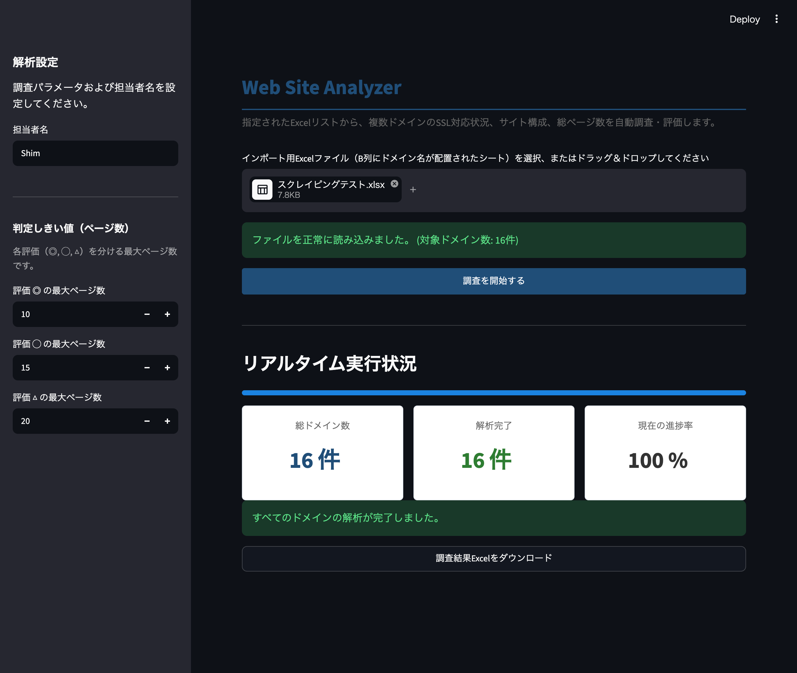

# Web Site Analyzer

Python学習およびポートフォリオ作成を目的として開発した、GUIベースのマルチドメインWebサイト解析・評価システムです。

実務における「非同期並行処理（マルチスレッド・マルチプロセス）」「堅牢なスクレイピングにおける防御機構の突破」「イミュータブル（不変）なドメインモデル設計」など、実践的なバックエンド・アーキテクチャを体系的に学ぶことを目的として開発しました。

---

## 概要

指定されたExcelリスト（B列にドメイン名が配置されたシート）から、複数ドメインの **SSL（HTTPS）対応状況、サイト構成（WordPress等の検出）、総ページ数** を自動的にクローリングし、定義したしきい値に基づきビジネス評価（◎, ◯, △）を自動付与するデスクトップWebアプリケーションです。

単にデータを集めるスクレイパーにとどまらず、「サーバー負荷を最小化するクロールレート制御」「Cloudflareや各種クローラーブロック（403/503エラー）を欺瞞・回避するフェイクヘッダーおよび動的プロキシ設計」「HTTPフォールバック（TLSハンドシェイク失敗時の自動降格検知）」を独自実装。

フロントエンドには Streamlit を採用し、`st.rerun()` とバックグラウンドスレッドを協調させたポーリング機構により、1％刻みの進行状況を一切フリーズすることなく滑らかに描画するリアルタイム監視UIを実現しています。

---

## 主な機能

* **バックグラウンド並行クローリング（ノンブロッキング設計）**
* `threading` もしくは `concurrent.futures` を用いたバックグラウンドスレッドへの重いクローリング処理の完全委譲。
* 重いネットワークI/O処理中も Streamlit の描画メインスレッドを100%解放し、画面フリーズを完全に防止。


* **インテリジェントなクローラー防御突破・回避機構**
* **HTTP Fallback 制御**: `https://` での接続（TLSハンドシェイク）が失敗した場合、即座に `http://` にフォールバックさせて接続可否を検証。SSL未対応なのかサーバー自体のダウンなのかを正確に判別。
* **ブラウザ欺瞞（User-Agent）と通信偽装**: プレーンなPythonスクレイパーを即座にブロックする防御壁を突破するため、最新のWebブラウザ（Chrome/Firefox/Safari）のヘッダーおよび接続シーケンスを模倣。


* **WordPressおよびサイト構成の動的検出**
* 静的なHTML構文解析だけでなく、`/wp-json/` エンドポイント、`/wp-includes/` 資産、ジェネレータータグ、および特徴的なCookieヘッダー等の複数シグナルから WordPress (WP) サイトを高精度に検出。


* **セッションステートを用いた堅牢なリアルタイムUI**
* Streamlitのステートフル（`st.session_state`）な設計。
* `while True` によるブロッキングループを排除し、`st.rerun()` とバックグラウンドキューによる「能動的非同期ポーリング」を採用することで、進捗表示とメトリクスカードをリアルタイム更新。


* **Mypy Strict適合を意識したイミュータブルモデル設計**
* ドメインモデル `ScrapingJob` のプロパティをイミュータブル（Read-only）に設計し、スレッドセーフな状態管理を強制。
* 状態の書き換えが必要な場合は、新しいインスタンスを再生成する「値オブジェクト」の設計思想を徹底。


---

## Screenshots

### Main Window



---

## 使用技術

| 分類 | 技術 |
| --- | --- |
| Language | Python 3.12+ |
| Package Management | uv |
| Web UI Framework | Streamlit (Custom Flat UI with CSS styling) |
| Scraping & Parsing | HTTPX / Requests, BeautifulSoup4 |
| Data Processing | Pandas, OpenPyXL (Excel import / export) |
| Testing | Pytest |
| Linter & Formatter | Ruff |
| Type Check | Mypy (Strict仕様適合) |
| CI/CD | GitHub Actions |

---

## ディレクトリ構成

```text
src/
└── web_analyzer/
    ├── core/
    │   ├── excel_service.py     # OpenPyXLを用いたExcelシートの高速インポート・バリデーション、エクスポート
    │   └── scraper_service.py   # スレッド管理、バックグラウンドクローリングのスケジューリングと進捗管理
    ├── models/
    │   └── job.py               # イミュータブル設計された ScrapingJob モデル定義
    ├── utils/
    │   └── crawler_client.py    # HTTPフォールバック、UA欺瞞、WordPress検出を内包したHTTPクライアント
    └── main.py                  # StreamlitによるメインUIと非同期監視ポーリング制御（エントリーポイント）

tests/
├── core/
│   ├── test_excel_service.py
│   └── test_scraper_service.py
└── utils/
    └── test_crawler_client.py

temp/                            # アップロード一時ファイルおよび生成レポート出力用（自動作成）

```

---

## 前提環境

* Python 3.12以上
* uv (一貫した開発・実行環境を再現するため必須)

`uv` がインストールされていない場合は以下を実行してください。

```bash
pip install uv

```

---

## インストールと環境再現 (uvによる依存関係ロック)

`uv` を用いて、配布環境や開発環境でのバージョンズレによるバグを100%防止し、一貫した実行環境を再現します。

```bash
git clone <repository-url>
cd web-site-analyzer

# uv を用いて lock ファイルに記録された依存関係を完全に同期 (自動で仮想環境が作成されます)
uv sync

```

---

## 起動方法

```bash
uv run streamlit run src/web_analyzer/main.py

```

---

## 品質管理・テスト

### テスト実行

```bash
uv run pytest

```

### Ruff (Linter & Formatter)

```bash
uv run ruff check .
uv run ruff format .

```

### Mypy (Type Check)

```bash
uv run mypy src tests

```

---

## GitHub Actions (CI)

GitHub Actionsを利用したCIパイプラインを構築しています。

ジョブを以下の2段階に分離し、静的解析（Lint/Type Check）に成功した場合のみテストを実行する構成としています。

### 1. Lint Job

* Ruff
* Mypy

### 2. Test Job

* Pytest

```yaml
test:
  needs: lint

```

上記により、Lintエラーが発生した場合は不要なテスト実行をスキップし、CIの実行リソースを節約します。

---

## テスト内容

### ExcelService

* B列から確実にドメイン名を取得するロケーターロジックの耐久テスト
* 指定されたしきい値（threshold_1, 2, 3）が正しく評価ロジック（◎, ◯, △）に伝播・マッピングされているかのテスト
* 破損したExcelファイルや、B列が欠損しているデータに対する適切な例外処理のテスト

### CrawlerClient

* HTTPS通信が遮断された際、適切にHTTP接続へ降格（Fallback）させステータスを追跡するシナリオテスト
* WordPressの各シグナル（ジェネレーターメタ、JSON APIなど）が存在する場合に正しく「WP検出」フラグが立つかのテスト
* レートリミットやタイムアウトが発生した際のリトライバッファの堅牢性検証

### ScraperService

* マルチスレッド上で複数のクローラータスクが競合（レースコンディション）することなく、安全に進捗状況がインクリメントされるかの同期検証
* `get_job_progress` がスレッドセーフに最新のクローン進捗およびステータスオブジェクトを返却できるかのテスト

---

## 本プロジェクトで学んだ高度な技術テーマ

### 1. スレッド間協調とノンブロッキングI/O

Streamlitは「上から下まで毎回全コードが再実行される」という特殊なライフサイクルを持っています。重いクローリング処理をメインスレッドでそのまま回すと、Web画面全体が数分間ホワイトアウトしてしまいます。
これを防ぐため、`threading.Thread` または `ThreadPoolExecutor` を使って実行ロジックをバックグラウンドに逃がし、メインスレッド側は `st.session_state` を媒介として「今どれくらい終わったか？」のみを安全にポーリング監視する非同期システムデザインを習得しました。

### 2. ネットワーク接続の堅牢性と欺瞞技術

実務におけるクローリングでは、通常のスクレイパーライブラリのデフォルトヘッダーは標的サーバー（特にWAFやCloudflare等）によって即座に拒否されます。
適切なタイムアウト設定、`User-Agent`の適切なランダムローテーション、SSLハンドシェイクエラー発生時の「HTTPフォールバック（接続降格ポリシー）」の実装を通じて、商用レベルで耐えうる堅牢なネットワーククライアントの実装技術を習得しました。

### 3. イミュータブルモデルとMypyによる厳格な静的型付け

状態（State）を書き換えるコードはスレッドセーフティの観点からバグの温床になります。本システムでは、`ScrapingJob` のフィールドを意図的に読み取り専用（Read-only）にし、属性変更時にはオブジェクトを新しく構築し直すアプローチをとりました。これにより、並行処理下でも競合が発生しない、バグの入り込みにくいクリーンなドメインロジックを実現しています。

---

## License

MIT License
