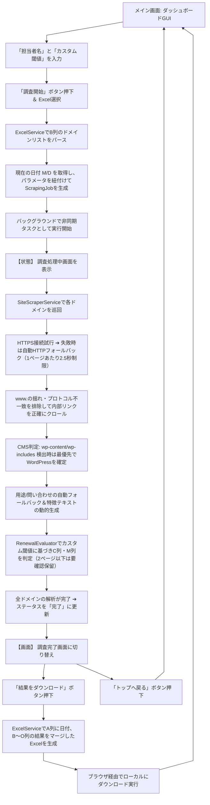

# 画面遷移・処理フロー図

メイン画面を中心に、Excelインポートから非同期スクレイピング、カスタム判定、および結果ダウンロードの処理フローです。

```mermaid
%%{init: {'flowchart': {'curve': 'linear'}}}%%
flowchart TD
    A[メイン画面: ダッシュボードGUI]

    %% --- 1. 調査実行フロー ---
    A --> B[「担当者名」と「カスタム閾値」を入力]
    B --> C[「調査開始」ボタン押下 ＆ Excel選択]
    C --> D[ExcelServiceでB列のドメインリストをパース]
    D --> E[現在の日付 M/D を取得し、パラメータを紐付けてScrapingJobを生成]
    E --> F[バックグラウンドで非同期タスクとして実行開始]
    F --> G[【状態】 調査処理中画面を表示]

    %% --- 2. バックグラウンド処理フロー ---
    G --> H[SiteScraperServiceで各ドメインを巡回]
    H --> I[HTTPS接続試行 ➔ 失敗時は自動HTTPフォールバック（1ページあたり2.5秒制限）]
    I --> J[www.の揺れ・プロトコル不一致を排除して内部リンクを正確にクロール]
    J --> K[CMS判定: wp-content/wp-includes 検出時は最優先でWordPressを確定]
    K --> L[用途/問い合わせの自動フォールバック＆特徴テキストの動的生成]
    L --> M[RenewalEvaluatorでカスタム閾値に基づきC列・M列を判定（2ページ以下は要確認保留）]
    M --> N[全ドメインの解析が完了 ➔ ステータスを「完了」に更新]
    N --> O[【画面】 調査完了画面に切り替え]

    %% --- 3. ダウンロードフロー ---
    O --> P[「結果をダウンロード」ボタン押下]
    P --> Q[ExcelServiceでA列に日付、B〜O列の結果をマージしたExcelを生成]
    Q --> R[ブラウザ経由でローカルにダウンロード実行]
    R --> A

    %% --- 4. トップへ戻るフロー ---
    O --> S[「トップへ戻る」ボタン押下]
    S --> A

```
