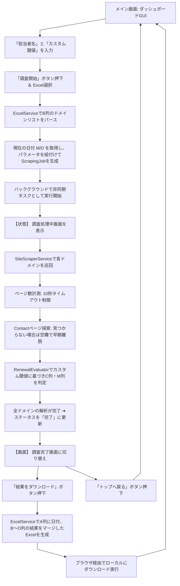

# 3. 画面遷移・処理フロー図

メイン画面を中心に、Excelインポートから非同期スクレイピング、カスタム判定、および結果ダウンロードの処理フローです。

### 画面UI（ダッシュボード）の具体的なイメージ

画面の「設定エリア」には、以下のようなフォームが並ぶイメージになります。

> **[ ツール設定 ]**
> * 担当者名: `[ 山田 太郎                 ]`
> * 判定ページ数基準（しきい値）：
> * ◎ 判定の基準: `[ 10 ]` ページ以下
> * ◯ 判定の基準: `[ 15 ]` ページ以下
> * △ 判定の基準: `[ 20 ]` ページ以下 （これを超えると自動的に「×：ページ数が多いため」になります）
>
>
>
>
> `[ここにExcelファイルをドラッグ＆ドロップ]`
> `[ ⚡ 調査を開始する ]`
