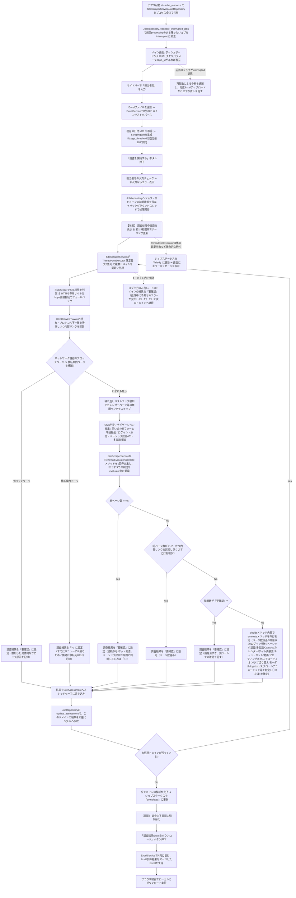

# 画面遷移・処理フロー図

メイン画面を中心に、起動時のジョブ復旧、Excelインポートから並列スクレイピング、判定、および結果ダウンロードの処理フローです。

```mermaid
%%{init: {'flowchart': {'curve': 'linear'}}}%%
flowchart TD
    Z0["アプリ起動 st.cache_resource でSiteScraperService/JobRepositoryをプロセス全体で共有"] --> Z1["JobRepository.reconcile_interrupted_jobsで前回processingのまま残ったジョブをinterruptedに修正"]
    Z1 --> A["メイン画面: ダッシュボードGUI ※URLクエリパラメータのjob_idがあれば復元"]
    A --> B["サイドバーで「担当者名」を入力"]
    B --> C["Excelファイルを選択 ➔ ExcelServiceでB列のドメインリストをパース"]
    C --> D["現在の日付 M/D を取得し、ScrapingJobを生成 ※page_thresholdは既定値10で固定"]
    D --> E["「調査を開始する」ボタン押下"]
    E --> F["担当者名の入力チェック ➔ 未入力ならエラー表示"]
    F --> F2["JobRepositoryへジョブ・全ドメインの初期状態を保存 ➔ バックグラウンドスレッドで処理開始"]
    F2 --> G["【状態】 調査処理中画面を表示 ＆ 約1.5秒間隔でポーリング更新"]

    %% --- 2. バックグラウンド処理フロー（ThreadPoolExecutorによるドメイン単位の並列実行） ---
    G --> H["SiteScraperServiceがThreadPoolExecutor 既定最大5並列 で複数ドメインを同時に処理"]
    H --> I["SslCheckerでSSL状態を判定 ＆ HTTPS専用サイトはhttps直接接続でフォールバック"]
    I --> J["WebCrawlerでwww.の揺れ・プロトコル不一致を吸収しつつ内部リンクを巡回"]
    J --> J1{"ネットワーク機器のブロックページ or 移転案内ページを検知?"}
    J1 -- ブロックページ --> J1a["調査結果を『要確認』に設定（検知した具体的なブロック原因を記録）"]
    J1 -- 移転案内ページ --> J1b["調査結果を『×』に設定（すでにリニューアル済のため／備考に移転先URLを記録）"]
    J1 -- いずれも無し --> K["繰り返しパストラップ検知でカレンダーページ等の無限リンクをスキップ"]
    K --> L["CMS判定 / ナビゲーション抽出 / 問い合わせフォーム項目抽出 / ログイン・添付・ベーシック認証401・多言語検知"]
    L --> M2["SiteScraperServiceがRenewalEvaluatorのdecideメソッドを1回呼び出し、以下すべての判定をevaluator側に委譲"]
    M2 --> M{"総ページ数 == 0?"}
    M -- Yes --> N["調査結果を『要確認』に設定（接続不可/ボット拒否。ベーシック認証が原因と判明していれば『×』）"]
    M -- No --> O{"総ページ数が1〜2、かつ内部リンクを巡回し尽くさずに打ち切り?"}
    O -- Yes --> P["調査結果を『要確認』に設定（ページ数極小）"]
    O -- No --> Q{"階層数が『要確認』?"}
    Q -- Yes --> R["調査結果を『要確認』に設定（階層深すぎ、別ツールでの確認を促す）"]
    Q -- No --> S["decideメソッド内部でevaluateメソッドを呼び判定（ページ数超過/3階層以上/ログイン/添付/ベーシック認証/多言語/Captcha/カレンダー/サイト内検索/チャットボット/動画/フローティングボタン/アコーディオン/タブ切り替え/モーダル/Lightbox/スクロールアニメーション等を判定し◯または×を確定）"]
    J1a --> T["結果をSiteAssessmentへスレッドセーフに書き込み"]
    J1b --> T
    N --> T
    P --> T
    R --> T
    S --> T
    T --> T2["JobRepositoryのupdate_assessmentで、このドメインの結果を即座にSQLiteへ反映"]
    T2 --> U{"未処理ドメインが残っている?"}
    U -- Yes --> H
    U -- No --> V["全ドメインの解析が完了 ➔ ジョブステータスを「completed」に更新"]
    V --> W["【画面】 調査完了画面に切り替え"]

    %% --- 3. ダウンロードフロー ---
    W --> X["「調査結果Excelをダウンロード」ボタン押下"]
    X --> Y["ExcelServiceでA列に日付、B〜O列の結果をマージしたExcelを生成"]
    Y --> ZZ["ブラウザ経由でローカルにダウンロード実行"]

    %% --- 4. 異常系フロー ---
    H -.->|1ドメイン内で例外| AA["ログ出力のみ行い、そのドメインの結果を『要確認』（処理中に予期せぬエラーが発生しました）として次のドメインへ継続"]
    G -.->|ThreadPoolExecutor自体の起動失敗など致命的な例外| AB["ジョブステータスを「failed」に更新 ➔ 画面にエラーメッセージを表示"]
    A -.->|前回のジョブがinterrupted状態| AC["再起動による中断を通知し、再度Excelアップロードからのやり直しを促す"]
```

## 補足・旧仕様からの変更点

* サイドバーに「カスタム閾値」を入力させるUI要素は**削除**されている。判定に使われる `page_threshold` は `ScrapingJob` の既定値（`10`）で固定運用される。
* 旧仕様にあった「閾値1〜3による◎/◯/△/×の4段階判定」は廃止され、現在は **◯/×の2値＋要確認** の運用になっている。
* **バックグラウンド処理は「ドメイン単位の逐次処理」ではなく、`ThreadPoolExecutor`によるドメイン単位の並列処理（既定最大5並列）に変更されている。** 1ドメインの処理失敗（例外）はログに記録された上でそのドメインだけ「要確認」として次へ進む。ジョブ全体が失敗扱いになるのは、`ThreadPoolExecutor`の起動自体が失敗するなど個別ドメインの範囲外で予期しない例外が発生した場合のみ。
* **ジョブ・調査結果の状態がSQLite（WALモード）へ永続化されるようになった。** ジョブ開始時に全ドメインの初期状態を保存し、1ドメインの解析が完了するたびに即座にその行だけをDBへ反映する。これにより、処理途中でアプリが強制終了しても、完了済みの結果はディスクに残る。
* **アプリ起動時に`reconcile_interrupted_jobs()`を実行し、前回`processing`のまま異常終了して残っていたジョブを自動検出して`interrupted`状態に修正する処理が新設された。** 画面には「前回の処理は中断されました。再度Excelをアップロードしてやり直してください」という趣旨のメッセージが表示される。
* **クロール開始直後〜巡回中に、ネットワークセキュリティ機器（Fortinet等）によるブロックページ、または別ドメインへ自動遷移する移転案内ページを検知する分岐が新設された。** これらを検知した場合は`RenewalEvaluator.decide()`を呼ばずに結果を確定する（前者は「要確認」＋検知したブロック原因、後者は「×（すでにリニューアル済）」＋備考欄への移転先URL記録）。
* 「要確認」に倒れる条件が3パターンに増えている（総ページ数0／総ページ数1〜2かつキュー未消化／階層数計測不能）。ページ数1〜2でも、内部リンクを発見し尽くして自然にキューが空になった場合（`queue_exhausted=True`）は「本当にページ数の少ないサイト」とみなし通常の判定へ進む。
* `×`判定の理由に多言語対応（言語切り替え機能）が追加されている。クローラー側での検知に加え、evaluator側でもHTML内の言語切り替えUIを二重にチェックする。**「ステップ型フォーム」「PDF資料が多い」という判定理由は実装されていない。**
* アコーディオン／タブ／モーダル／フローティングボタンの検知は機能ごとに独立したCSSセレクタで判定しており、汎用属性（`data-toggle`/`aria-expanded`）は誤検知の原因になり得るため使用していない。
* `WebCrawler.crawl_and_analyze`の戻り値は**14要素**のtupleに拡張されている（`has_multilang`、`blocked_reason`、`redirect_target_url`、`queue_exhausted`を含む）。
* `models.py`は`web_analyzer/core/models.py`ではなく`web_analyzer/models.py`に配置されている。
* ロギング基盤が整備され、`main.py`起動時に`setup_logger()`を1回呼び出すことで、コンソールに加えて実行ごとに個別のログファイル（`logs/app_YYYYMMDD_HHMMSS.log`）にもログが出力されるようになった。あわせて`measure_time`（処理時間計測）・`log_action`（開始/完了ログ）デコレータが、クロール・SSLチェック・Excel出力の各処理に適用されている。
* 「要確認」に倒すかどうかの判断（総ページ数0／1〜2／階層計測不能）は`RenewalEvaluator.decide()`に集約されており、`SiteScraperService`はSSLチェック→クロール→（ブロック/移転チェック）→`decide()`呼び出し→結果書き込み→DB即時反映、というオーケストレーションに専念する。
